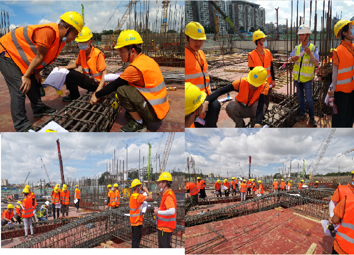

### 精淬计划小感想

<h5 align = "center">
    <i>
           &mdash;		By 梁钜皓
    </i>
</h5>

#### “精淬计划” Day 1

​		充实的一天就应该从早上5点半开始(:dog:)。

​		今天是精淬计划正式开启的第一天。今天的安排是早上6点出发，到项目的现场绑扎钢筋；然后下午13点45到项目部的会议室参与线上开班典礼。

​		早上5点多起床也无法阻挡同事们高涨的热情，各位同事不仅没有抱怨，甚至还十分积极地参与扎钢筋的工作，也许这就是“敢为天下先，永远争第一”的南方新青年吧！由于南南子们太过优秀，才练习不久很多人就从新手成为了大师，真就入门到精通只要10分钟，说的就是我们吧！经过3个多小时的共同努力，我们就把半个现场的钢筋都给绑完了。任务完成，意犹未尽的同事们只能撤退了。

 钢筋绑扎现场剪影

​		下午是在会议室观看线上的开班典礼。通过线上的开班典礼，我们都进一步了解了三局的历史和发展，以及三局的企业文化和价值观。董事长的讲话以及和员工的交流互动内容耐人寻味，发人深省。

​		感悟环节：新人入职要调整好心态，你的下一份工作，何必不是钢筋工(:dog:)。梦想和现实总有些落差，我们要脚踏实地，做好一些繁琐而枯燥的工作，不要眼高手低，总是觉得自己要做大事。就像董事长所说的，工作之后，我们会发现这可能和我们想象中有很大的区别，因为我们的工作更多的时候做的是一些琐碎且没有什么技术含量，并且是有些枯燥且重复性较高的事，我们很多时候就是不断的重复。总之，“一屋不扫何以扫天下”，我们既要仰望星空，也要脚踏实地。先把小事情做好，这就是为了做好大事做准备。

​		**总之，我们要做爱国爱企、敢于争先、脚踏实地的三局人！**

2020年07月14日

#### “精淬计划” Day 2

​		今天的议程为：上午观看内部讲师大赛决赛直播，下午为2020年“星青年”入职培训。

##### 内部讲师大赛决赛

​		上午的内部讲师大赛决赛内容可以说是干货满满。12位参赛选手实力惊人，果然是三局里面个个都是人才，只要8分钟，就能让我们get到不少新知识。

​		尤其是我们南方公司的两位选手：王沙和牛滢。通过案例驱动，将抽象的知识和概念具体化，让人容易理解，台风大气，最终的结果也是名副其实。也许这就是南方公司的实力吧，爱了爱了！

内部讲师大赛决赛颁奖经典场面

##### 入职培训

​		下午的入职培训主要分两个内容：一个是由局领导介绍企业的基本情况和企业的发展战略；另外一个就是参与建设两山青年的分享和感悟。

​		通过领导对企业的介绍，深感“创业维艰”，同时也为自己能够成为三局的一员感到荣幸。两山建设青年的分享感人肺腑，他们的逆行诠释了什么叫做担当。

    
    

入职培训片场照片

##### 小结

1. 三局人才济济，三局青年大有可为。
2. 作为新员工，我们需要学习的内容还有很多。
3. 作为三局的一员，我们要从我做起，认真学习，刻苦工作，做到品质过硬。**我们所在的地方，就是三局**。

 2020年07月15日

#### “精淬计划” Day 3

​		上午到现场检查钢筋梁的配筋情况。由于本人没学过这些东西，而且现场人很多，师父只有一个，加上工地噪声比较多，导致我没能听清楚佩哥的讲解，以至于后面的实操搞得我很自闭。不过后面经过了小伙伴以及各位前辈的悉心指导，我也基本掌握了配筋图的各项参数的含义。在这里要实名表扬周哥。

实操现场“划水”合集

​		下午在会议室看图集。没什么可以说的，直接上个收获满满的图片(:pray:)

    
    

干货满满的照片(手动/doge) 

**日常的感悟环节**：感谢各位小伙伴以及各位前辈的悉心教导，以后我一定认真学习。不说了，我这就去看两本图集(:pray:)

 2020年07月16日
